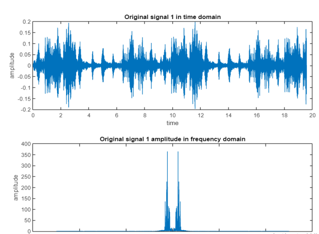
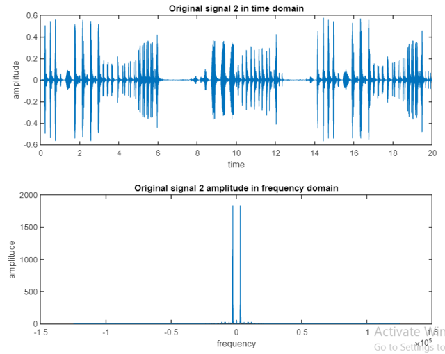
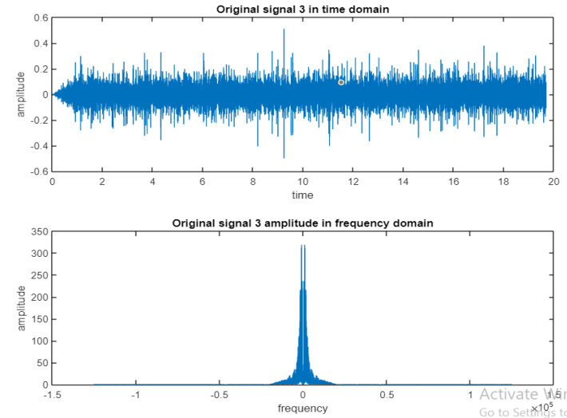

# Communication-modulation-demodulation-project

**It is required to modulate three speech signals using the following scheme:**

## s(t)=x1(t)cosω1t+x2(t)cosω2t+x3(t)sinω2t

and then perform synchronous demodulation..

**1) Obtain the modulated signal. Plot it in time domain. Plot its magnitude spectrum.**

**2) Perform synchronous demodulation to restore the three signals.**

**3) Perform demodulation three times with phase shifts of 10, 30, 90 degrees for both carriers.**

**4) For , perform demodulation two times with a local carrier frequency that is different by 2 Hz and 10 Hz from its carrier frequency.**

###### Results, answers and comments:

**2-_In synchronous demodulation_:
each signal is restored with half the magnitude of the original signals.**

**3- _Phase shift = 10:_**

**-Signal1 =>very little attenuation (making it lower than the original ones)**

**-Signals 2 & 3=> interfere slightly with each other’s**

 **_Phase shift = 30:_**
 
 **-Signal1 =>more attenuation (making it lower than the original ones)**
 
 **-Signals 2 & 3=> interfere more with each other’s**
 
**_Phase shift = 90:_**

**-Signal1 =>completely attenuation (no audio) (making it lower than the original ones.)**

**-Signals 2 & 3=> interchanged where signal 2 is restored when demodulating to restore signal 3 & vice versa.**

**4-_frequency shift_ makes attenuation and distortion of the output signal
In case of 10 => attenuation and distortion of the signal are more than in case of 2**

**In order to demodulate the received signal at the receiver we use a synchronous carrier same as modulating carrier.**

**Using a synchronous carrier may cause attenuation or noise to the received signal if the local carrier in the receiver is not synchronized with the received signal carrier.**

**Phase error may cause attenuation of the output signal without causing distortion as long as it is constant. Attenuation increases as phase error increases.**

**Sin and cos signals with the same fc interfere together in the case of phase shift. The interference between them increase when phase shift increase. When phase shift reaches 90, they are completely interchanged.**

**Frequency shift causes attenuation and distortion of the output signal**
